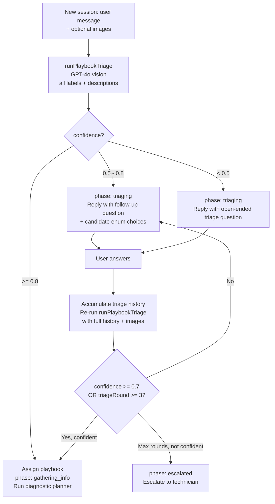

# Multi-Turn Diagnostic Chat Logic (Updated for Triage Redesign)

This document explains how the diagnostic chat now works after the playbook triage redesign.

It focuses on the `/chat` -> `/api/chat` flow and covers:

- how a playbook is chosen,
- how triage follow-up works,
- how photos are used,
- how the diagnostic loop runs,
- when the system resolves or escalates.

---

## Quick Glossary

- **Playbook**: Structured troubleshooting guide for one issue label (evidence checklist, causes, steps, escalation triggers).
- **Triage**: Pre-diagnosis phase where the system picks the correct playbook label.
- **Evidence**: Facts collected from user responses (text, readings, photos, confirmations).
- **Hypothesis**: Possible root cause with confidence and status.
- **Phase**: Session state: `collecting_issue`, `nameplate_check`, `product_type_check`, `clearance_check`, `triaging`, `gathering_info`, `diagnosing`, `resolving`, `resolved_followup`, or `escalated`.
- **RAG**: Retrieval-augmented generation using document chunks for grounded responses.
- **Requests**: Structured next-step prompts (question/photo/action/reading).
- **SSE**: Streamed backend events used by chat UI for stages + final response.

---

## High-Level System Flow

1. User sends issue details and optional photos.
2. Backend runs intake gates in order: `collecting_issue` -> `nameplate_check` -> `product_type_check` -> `clearance_check`.
3. In `clearance_check`, user uploads machine-clearance photos from different angles (stored for escalation use only).
4. After intake, backend enters `triaging` and runs GPT-4o vision triage to select a playbook.
5. If confident, backend assigns playbook and enters diagnostic loop.
6. If not confident, backend asks a triage follow-up question (often with candidate options).
7. If still not confident after max triage rounds, backend escalates to technician.
8. During diagnosis, backend runs RAG + planner each turn, updates evidence/hypotheses, and moves toward resolve/escalate.

---

## New Triage Flow

---

## Turn 1 (New Session) - Updated Behavior

### 1) Frontend request

UI sends `FormData` with:

- `message`
- optional `machineModel`
- optional `sessionId`
- optional `images[]`

### 2) Session bootstrap

For a new conversation, backend creates a `diagnostic_sessions` row with:

- `playbookId = null`
- `phase = "triaging"`
- `triageHistory = []`
- `triageRound = 0`
- normal diagnostic state fields (`messages`, `evidence`, `hypotheses`, `turnCount`)

### 3) Triage model call (text + image together)

Backend calls `runPlaybookTriage()`:

- inputs all available labels + playbooks,
- includes triage history text,
- includes current-turn images as vision inputs when present,
- asks GPT-4o for JSON:
  - `selected_label_id`
  - `confidence`
  - `follow_up_question`
  - `candidate_labels`

### 4) Triage decision

Config thresholds (`TRIAGE_CONFIG`):

- `autoSelectThreshold` (default `0.8`)
- `confirmThreshold` (default `0.7`)
- `maxRounds` (default `3`)

Behavior:

- **Auto-select** if model picks a label with confidence >= auto-select threshold.
- **Follow-up** if not confident:
  - backend responds in phase `triaging`
  - asks follow-up question
  - may send enum candidate options (2-3) for faster user selection
- **Escalate** if triage rounds hit max and confidence is still insufficient.

### 5) Diagnostic starts only after playbook is assigned

Once playbook is selected:

- session updates to `phase = "gathering_info"`
- `playbookId` is set
- same request proceeds into normal RAG + planner flow

---

## Turn 2+ Behavior

There are now two possible loops:

### A) Triage loop (`phase = triaging`)

Each message:

1. Append user input to `triageHistory`.
2. Re-run GPT triage with full triage history + current images.
3. Either:
   - choose playbook and move to diagnostic phases, or
   - ask another triage follow-up, or
   - escalate if max rounds reached.

### B) Diagnostic loop (`phase != triaging`)

Each message:

1. Save user message + any photos.
2. Determine outstanding request IDs from prior assistant turn.
3. Run text retrieval (RAG) against docs.
4. Run planner (`runDiagnosticPlanner`) with:
   - playbook
   - evidence + hypotheses + phase + turn count
   - recent messages
   - doc chunks
   - action metadata
   - latest message
   - outstanding request IDs
   - current images (vision input)
5. Sanitize planner output.
6. Persist evidence/hypotheses/phase/status/messages.
7. Stream assistant response and structured request(s).

---

## Image Handling (Now)

Images are used in three important places:

### 1) Playbook triage (new or still-triaging sessions)

- Photos are sent directly to GPT-4o triage together with message text.
- The system does **not** use CLIP similarity matching for playbook selection anymore.

### 2) Clearance intake photos

- During `clearance_check`, user uploads machine-clearance photos from multiple angles.
- These photos are stored in `diagnostic_sessions.clearance_image_paths`.
- These photos are **not** sent to LLMs during the clearance step itself.

### 3) Diagnostic planner turns

- Photos are sent to planner model as vision inputs.
- Prompt now explicitly instructs model to extract photo-derived evidence.
- Planner can return `photoAnalysis` per `evidence_extracted` item.
- Backend persists that `photoAnalysis` into session evidence so future turns keep visual context even without re-sending original photo.

### 4) Follow-up after resolution

- `runFollowUpAnswer` now also supports image inputs, so post-resolution Q&A can use vision too.

---

## Resolution and Escalation

### Resolution path

When planner returns `phase = resolving`:

- backend marks `status = resolved`
- sends resolution
- appends verification question:
  - "After trying these steps, please let me know: did that fix the issue?"

### Post-resolution outcomes

If user replies after resolution:

- positive -> `resolutionOutcome = confirmed`
- partial -> `partially_fixed`
- negative -> `not_fixed` and escalate
- ambiguous -> answer via follow-up RAG/LLM path

### Escalation paths

System escalates when:

1. safety trigger phrase in playbook is detected
2. diagnostic safety turn cap is exceeded
3. planner is stuck (no next step with enough evidence)
4. no new evidence across configured stall window
5. resolved-but-not-fixed feedback
6. triage cannot confidently choose playbook within max triage rounds

---

## Where AI Is Used

1. **Playbook triage** (`runPlaybookTriage`)
   - model: `LLM_CONFIG.classificationModel` (`gpt-4o`)
   - multimodal (text + images)

2. **Main planner** (`runDiagnosticPlanner`)
   - model: `LLM_CONFIG.diagnosticPlannerModel` (`gpt-4o`)
   - multimodal when images are provided
   - returns structured JSON plan

3. **Resolved follow-up answering** (`runFollowUpAnswer`)
   - model: `LLM_CONFIG.diagnosticPlannerModel` (`gpt-4o`)
   - can include images

4. **RAG query embedding**
   - OpenAI `text-embedding-3-small`

Note: CLIP embedding still exists in the codebase but is no longer used in the chat playbook-selection path.

---

## Debugging Checklist (Updated)

1. **Wrong playbook selected**
   - inspect triage input labels/playbooks and `triageHistory`
   - check triage confidence thresholds in `TRIAGE_CONFIG`
   - inspect triage follow-up prompt and candidate options

2. **Triage escalates too often**
   - confirm label descriptions are clear and distinct
   - verify `TRIAGE_MAX_ROUNDS` / confirm thresholds are appropriate
   - check whether users are responding to triage follow-up requests clearly

3. **Photo evidence not influencing diagnosis**
   - verify image buffers are present in planner call
   - verify prompt includes photo-submission context block
   - verify `evidence_extracted.photoAnalysis` is being returned and persisted

4. **Generic or ungrounded technical answers**
   - inspect retrieval query and chunk relevance
   - confirm citations `(document <id>)` are used and mapped back to retrieved chunks

5. **Premature escalation in diagnostic phase**
   - inspect escalation triggers and stall settings
   - check if evidence extraction repeatedly returns empty arrays

---

## Scope Note

This guide describes the multi-turn chat diagnosis flow in `/api/chat`.
Other endpoints (for example one-shot analysis flows) may use related components but have different orchestration.

# Multi-Turn Diagnostic Chat Logic (Simple, Detailed Guide)

This document explains, in plain English, how the app diagnoses a problem through chat.
It focuses on the multi-turn chat flow (`/chat` -> `/api/chat`) and explains:

- what happens on the first message,
- what happens on each follow-up message,
- when and how AI is used,
- when and how RAG is used,
- what happens when images are uploaded,
- how the app ends in resolution or escalation.

---

## Quick Glossary

- **Playbook**: A structured troubleshooting guide for one issue category (symptoms, evidence checklist, causes, resolution steps, escalation triggers).
- **Evidence**: Facts collected during chat (for example: a reading, a yes/no answer, or an observation).
- **Hypothesis**: A possible root cause with confidence.
- **Phase**: Current state of diagnosis: `gathering_info`, `diagnosing`, `resolving`, `resolved_followup`, or `escalated`.
- **RAG**: Retrieval-Augmented Generation. The app searches document chunks and gives them to the AI so replies are grounded in your docs.
- **Requests**: The next thing the assistant asks the user to do/answer (question, photo, action, reading).
- **SSE**: Server-Sent Events. The backend streams status updates and final message back to the chat UI.

---

## What The Chat System Actually Does

At a high level:

1. User sends message (and maybe photos).
2. Backend decides (or reuses) the correct playbook.
3. Backend retrieves relevant knowledge chunks (RAG).
4. Planner AI decides what to ask next, what evidence was learned, and whether to resolve or escalate.
5. Backend saves everything into the diagnostic session.
6. Frontend shows the assistant reply and any structured next input controls.
7. Repeat until resolved or escalated.

The assistant is not just free-chatting. It is trying to fill missing evidence and move the session toward a safe final outcome.

---

## End-To-End Flow By Turn

## Turn 1 (First User Message, New Session)

### 1) Frontend sends request

From the chat page, when user clicks Send:

- UI packages `message`, optional `machineModel`, optional `sessionId`, and `images` into `FormData`.
- It immediately appends the user message in UI.
- It posts to `/api/chat`.

### 2) Middleware checks access/rate limits

For `/api/chat`:

- If `CHAT_API_KEY` is set, request must include correct Bearer token.
- POST requests are rate-limited by client IP.

### 3) Backend checks if this is a new session

In `/api/chat`:

- If session ID is missing or not found -> this is a new diagnostic session.
- Backend must pick a playbook before full diagnosis begins.

### 4) Playbook selection logic (first-turn only)

The app tries these in order:

1. **Image-based playbook selection** (if images provided):
   - Convert each uploaded image to buffer.
   - Generate CLIP embedding for each image.
   - Search reference image embeddings in DB.
   - Aggregate similarity by label.
   - Pick top label and its playbook if available.

2. **Text-based playbook selection** (if no image match and text exists):
   - Send user message + label descriptions to `gpt-4o` classifier.
   - Parse JSON with `label_id`.
   - Find playbook for that label.

3. **Fallback**:
   - If still no playbook: use first available playbook in DB.

### 5) Session creation

Backend inserts a new `diagnostic_sessions` row with initial state:

- `status=active`
- selected `playbookId`
- empty `messages`, `evidence`, `hypotheses`
- `phase=gathering_info`
- `turnCount=0`

### 6) Save user message and image file paths

For chat flow:

- Uploaded images are written to storage under:
  - `storage/diagnostic_sessions/{sessionId}/turn_{n}_{i}.jpg`
- User message is appended to session messages with optional image paths.

### 7) RAG retrieval for this turn

Backend builds a retrieval query like:

- `{user_message} {playbook_label} troubleshooting steps causes`

Then:

- embeds query with OpenAI `text-embedding-3-small`,
- retrieves top matching chunks from `doc_chunks` using hybrid score:
  - vector similarity + keyword rank + exact literal boost,
- optionally prioritizes chunks matching machine model.

### 8) Planner AI runs

Backend calls diagnostic planner (`gpt-4o`) with:

- playbook structure,
- current evidence + hypotheses + phase + turn count,
- recent conversation window,
- retrieved doc chunks (with IDs for citations),
- actions metadata (if any),
- latest user message,
- machine model (if provided),
- outstanding previous request IDs,
- image buffers from current turn (if provided; sent as vision inputs).

Planner returns strict JSON:

- user-facing `message`,
- next `phase`,
- `requests` (what to ask/do next),
- `hypotheses_update`,
- `evidence_extracted`,
- optional `resolution` (if resolving),
- optional `escalation_reason`.

### 9) Backend sanitizes and enforces rules

Backend validates planner output and may modify it:

- limits requests to one-at-a-time chat flow,
- ensures request IDs are allowed,
- blocks technician-only actions for end users,
- normalizes request input type hints,
- if resolving, enforces playbook-grounded step IDs/instructions.

### 10) Save state + stream assistant reply

Backend:

- merges extracted evidence into session evidence map,
- updates hypotheses/phase/status/turn count,
- appends assistant message to session history,
- adds citations by matching `(document <chunkId>)` references to retrieved chunks,
- streams final `message` event to frontend.

Frontend:

- reads SSE stream,
- shows stage text while waiting,
- appends assistant reply,
- renders structured controls for requests (buttons/inputs/photo attach) when present.

---

## Turn 2+ (Active Diagnostic Loop)

Every follow-up user message repeats the same core loop with current session state:

1. Load existing session and prior messages/evidence/hypotheses.
2. Save current user message (and any new images).
3. Detect outstanding request IDs from last assistant message.
4. Run RAG retrieval for this new turn.
5. Run planner AI with new context.
6. Sanitize planner output.
7. Persist updated state.
8. Return assistant reply + new request (usually 1 at a time).

The session becomes more informed each turn because evidence accumulates.

---

## Resolution And Post-Resolution Behavior

## When phase becomes `resolving`

If planner returns a resolution:

- Backend marks session `status=resolved`.
- Assistant resolution message is sent.
- Backend appends a verification question automatically:
  - "After trying these steps, please let me know: did that fix the issue?"

So "resolved" is not always the end; the app waits for confirmation.

## Next user message after resolved

If no `resolutionOutcome` recorded yet, backend parses user sentiment:

- Positive words -> outcome `confirmed`, sends success follow-up.
- Partial words -> outcome `partially_fixed`, offers further help/escalation.
- Negative words -> outcome `not_fixed`, escalates to support immediately.
- Ambiguous -> treated as normal follow-up question; assistant answers from docs.

If already resolved and user asks a question:

- backend runs a lighter follow-up answer function (`gpt-4o`) using RAG chunks + prior resolution context,
- returns plain text answer with citations.

---

## Escalation Paths (How The App Decides To Hand Off)

The app escalates in multiple cases:

1. **Explicit escalation trigger phrase** in user message (playbook-defined safety trigger).
2. **Safety turn cap** exceeded (hard limit).
3. **Diagnosing but stuck**: no requests left + enough evidence but no conclusion.
4. **Stall**: several turns with no newly extracted evidence.
5. **Resolved-but-not-fixed** user feedback.

When escalated:

- session status is set to `escalated`,
- escalation reason is saved,
- escalation handoff payload is built,
- webhook is sent in fire-and-forget mode.

---

## Exactly When AI Is Used

## AI in chat flow (`/api/chat`)

1. **Playbook text classification** (new session only, only if image path did not choose playbook):
   - model: `gpt-4o` (hardcoded in chat route).

2. **Main diagnostic planner** (most active turns):
   - model: `gpt-4o` (`LLM_CONFIG.diagnosticPlannerModel`).
   - returns structured JSON plan for each turn.

3. **Resolved follow-up answering** (after resolution):
   - model: `gpt-4o` (`LLM_CONFIG.diagnosticPlannerModel`).
   - returns direct prose answer (not full planner JSON).

## AI for retrieval and image matching support

4. **RAG query embedding**:
   - model: OpenAI `text-embedding-3-small`.

5. **Image similarity embedding** (for first-turn playbook selection with photos):
   - CLIP via Replicate TinyCLIP (preferred if token exists) or HuggingFace CLIP endpoint fallback.

Important: all "reasoning reply" steps in chat are currently OpenAI `gpt-4o`.

---

## When RAG Is Used

RAG is used on diagnostic turns and resolved follow-up Q&A turns.

What happens:

1. Build retrieval query from user message + playbook label context.
2. Embed query to vector.
3. Retrieve top document chunks from DB.
4. Give chunk snippets + IDs to AI in prompt.
5. If assistant uses factual numbers/procedures, prompt tells it to cite `(document <id>)`.
6. Backend maps referenced IDs back to citation content and sends citations to UI.

So RAG is not optional garnish: it is core grounding data for technical answers and instructions.

---

## What Happens When User Submits An Image

There are two main image behaviors in chat:

1. **Initial playbook selection help (new session only)**:
   - image embeddings are compared to reference images,
   - top matching label may choose playbook.

2. **Current-turn visual context for planner**:
   - current turn images are also passed directly to planner model as base64 `image_url` parts,
   - planner can use them when extracting evidence or choosing next request.

Also:

- chat images are persisted on disk and path stored in message record,
- image uploads still work even if user message text is short/empty (frontend sends placeholder text),
- later turns with images do not rerun playbook selection, but images still inform planner reasoning for that turn.

---

## Annotated Example Conversation (What User Sees + What Backend Does)

This is an example of a realistic session.

## Turn 1

**User**: "The machine is making loud clicking sounds and output dropped. Model 6220." + uploads 2 photos.

**Backend does**:

1. Creates new session flow.
2. Runs image embedding + reference image search.
3. Chooses top matching label/playbook (for example: feed-system issue).
4. Saves image files to diagnostic session storage.
5. Runs RAG retrieval for this complaint.
6. Runs planner with playbook + chunks + images.
7. Returns assistant question request.

**Assistant** (example): "Thanks. I can help narrow this down. Is the clicking continuous during operation, or only when starting?"

## Turn 2

**User**: "Only when starting."

**Backend does**:

1. Loads existing evidence/hypotheses/messages.
2. Maps this answer to outstanding request ID.
3. Extracts evidence (`startup_only_clicking=true`, confidence approximate/exact).
4. Retrieves fresh chunks based on new turn text.
5. Planner updates hypotheses and asks next targeted check.

**Assistant** (example): "Got it. Next, please inspect the feeder area and confirm whether there is visible debris or misalignment."

## Turn 3

**User**: "There is debris near the feeder."

**Backend does**:

1. Extracts new evidence.
2. Hypothesis confidence for debris-related cause increases.
3. Planner may request one final confirming reading/action.

**Assistant** (example): "Thanks, that helps. Please clear the debris, then run one test cycle and tell me if the clicking remains."

## Turn 4

**User**: "I cleared it. Clicking is gone."

**Backend does**:

1. Evidence now sufficient to conclude.
2. Planner returns phase `resolving` with grounded resolution steps.
3. Backend enforces step grounding, saves resolved status.
4. Appends verification question.

**Assistant** (example): "Likely cause: feeder obstruction. Steps to resolve: ... After trying these steps, please let me know: did that fix the issue?"

## Turn 5

**User**: "Yes fixed."

**Backend does**:

1. Parses positive confirmation.
2. Sets `resolutionOutcome=confirmed`.
3. Sends closure message.

**Assistant** (example): "Great to hear the issue is resolved! If you have any other questions, feel free to ask."

If user had said "No, still happening", backend would record `not_fixed` and escalate to support.

---

## Debugging Checklist (Practical)

If behavior looks wrong, check these areas first:

1. **Wrong issue category on first turn**
   - Check playbook selection chain in `/api/chat`:
     - image matching path,
     - text classifier fallback,
     - first-playbook fallback.
   - Verify reference image embeddings and label mappings.

2. **Assistant asks poor or irrelevant follow-up questions**
   - Inspect planner input: playbook, recent messages, outstanding request IDs.
   - Confirm evidence checklist/action IDs are valid.
   - Confirm sanitization did not strip intended request.

3. **Answers feel generic / not grounded**
   - Check RAG retrieval quality:
     - query text construction,
     - chunk scores,
     - label/machine-model filtering.
   - Confirm chunk IDs exist and are passed to planner.

4. **No citations in response**
   - Planner message must include `(document <chunk-id>)` format.
   - Backend citation extraction only maps IDs present in this turn's retrieved chunks.

5. **Too many escalations or premature escalation**
   - Review escalation trigger phrases in playbook.
   - Check stall threshold and max turn settings.
   - Check evidence extraction quality (if no evidence is extracted repeatedly, stall escalation can fire).

6. **Image uploads not helping diagnosis**
   - Verify CLIP provider env setup (Replicate/HuggingFace) for initial matching.
   - Confirm planner receives `imageBuffers` for the turn.
   - Confirm uploaded files are non-empty and persisted in session storage.

---

## Important Scope Note

This guide describes the multi-turn chat diagnosis flow (`/api/chat`).
There is also a separate `/api/analyse` flow for one-shot/legacy analysis. It uses related components but has different orchestration.
